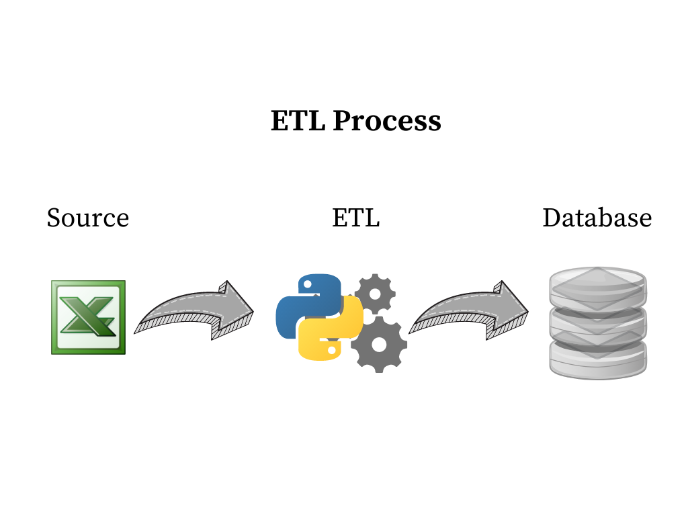

ANP Fuel Sales ETL
================

### Create new Python virtual environment and manage dependencies

### Requirements
* `python` 3.x
* `pip`
* [`virtualenv`](https://virtualenv.pypa.io/en/latest/)
* pandas 1.2.4


### Create new virtual environment
The following command creates a new virtual environment named `venv` in the current directory, usually this will be your project's directory.
```sh
$ virtualenv anpenv
```
OR
```sh
$ conda create -n anpenv python=3.8 anaconda
```


### Activate virtual environment
The following commands [activate](https://virtualenv.pypa.io/en/latest/userguide/#activate-script) an existing virtual environment on Windows and Unix systems. The command assume that the virtual environment is named `venv` and that its location is in a subdirectory `path/to/` of the current directory. 
```sh
# Windows (CMD.exe)
$ path\to\anpenv\Scripts\activate.bat
# Unix
$ source path/to/anpenv//bin/activate
```
Once the virtual environment has been actiated your console cursor might prepend the name of the virtual environment as shown below.
```sh
$ (anpenv) echo 'Hello World!'
```

### Deactivate virtual environment
The following command deactivates the current virtual environment, any dependency installed after this command will be installed globally.
```sh
$ (anpenv) deactivate
```


### Clone repository
https://github.com/davisonrebechi18/anp_project.git

<br/>
<br/>

### Solution:

The solution I used to work with the resources of the Python packages available 
and dealing with a spreadsheet in the old format, through the exploration and 
discovery of the data, environment of development I used operating system Linux 
and LibreOffice application to convert the .xls spreadsheet to a new version of 
the .xlsx file, making it possible to start the work through the raw data.

<br/>
<br/>

### Process




<br/>
<br/>

For this solution, pandas libraries for reading, manipulation and SQLite3 for data storage were used.

The process starts with reading the excel file through python programming.
The data are placed in 3 dataframes during processing, the first process keeping the raw data, an intermediate staging layer for data processing and the last dataframe with the enrichment and standardization of the data ready to be recorded to a database or to possibility to export via some other file extension.


### Metadata from file

<br/>
<br/>

Column        | Type          | Description
------------- | ------------- | -------------
COMBUSTÍVEL   | string        | Type of fuel (HYDROUS ETHANOL, PETROL C, PETROL OF AVIATION, etc)
ANO           | integer       | Year
REGIÃO        | string        | region of Brazil
STATE         | string        | State of region
UNIDADE       | string        | Unit of measurement
JANEIRO       | double        | Total sold in January
FEVEREIRO     | double        | total sold in February
MARÇO         | double        | total sold in March
ABRIL         | double        | total sold in April
MAIO          | double        | total sold in May
JUNHO         | double        | total sold in June
JULHO         | double        | total sold in July
AGOSTO        | double        | total sold in August
SETEMBRO      | double        | total sold in September
OUTUBRO       | double        | total sold in October
NOVEMBRO      | double        | total sold in November
DEZEMBR       | double        | total sold in December
TOTAL         | double        | total sold in year


<br/>
<br/>


The process extracts 2 tables:

 - Sales of oil derivative fuels by UF and product;
 - Sales of diesel by UF and type;
 
<br/>
<br/>

### Schema 

<br/>
<br/>

Column | Type
------------- | -------------
year_month  | date
uf          | string
product     | string
unit        | string
volume      | double
created_at  | timestamp

<br/>
<br/>

Other solutions and services could complement this project as a job scheduler to run daily to feed the database.
Another possibility would be the delivery of reports ready for the business area, communicating through an email with the status and kpi's to the user. 

*A tecnologia move o mundo.*
> Steve Jobs
